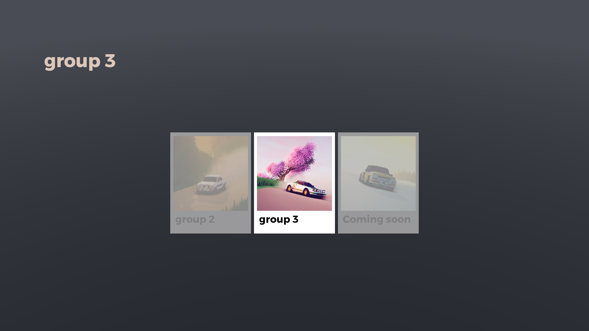
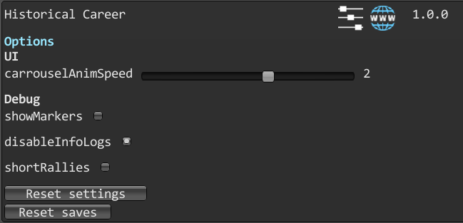

# Historical Career

A mod for Art of Rally which overhauls the career to retrace historical rallies.

#### Launcher Support

#### Platform Support

## Disclaimer

This mod is huge and might brake (or be broken by) other mods.\
Here is a list of known mods that are incompatible with this mod :
- [Matching Dates](https://github.com/MMike17/ArtOfRally_MatchingDates)

## Content

Here is the list of groups available in the mod : 

- **Group 2**
- **Group 3**

Following groups are being developped actively.

## Usage

Press Ctrl + F10 to open the mod manager menu.\
By default, the mod replaces the career mode entirely and blocks car/livery selection.\
Please reset career progress from the "profile" settings panel before starting to use the mod as native season saves might crash the mod.

- **carrouselAnimSpeed** : will change the speed at which the carrousel moves with player input.

Disabling the mod in the manager will revert to the normal career behaviour by default.\
This might need a game restart or save reset to work normally.

## Installation

Follow the [installation guide](https://www.nexusmods.com/site/mods/21/) of
the Unity Mod Manager.\
Then simply download the [latest release](https://github.com/MMike17/ArtOfRally_HistoricalCareer/releases/latest)
and drop it into the mod manager's mods page.

## Showcase

